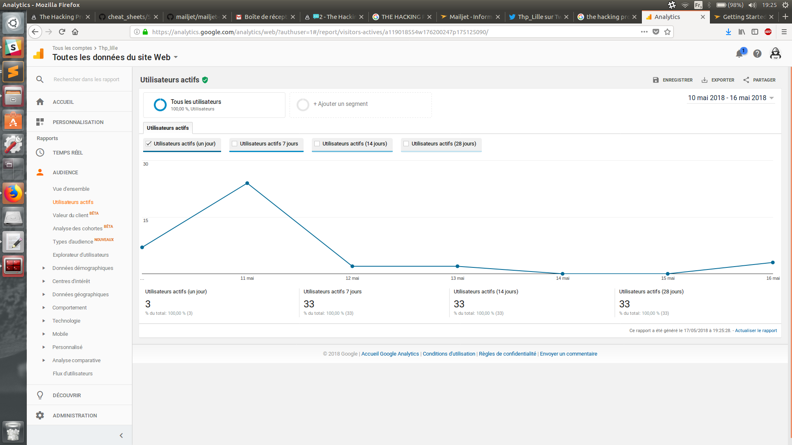
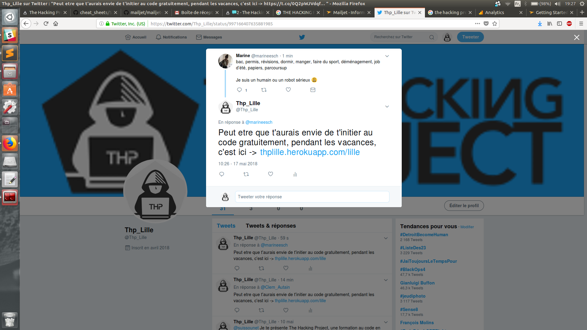

Projet LandingPages final W7D4 - team Lille - @Guillaume @Kalejo @AmpueroPierre @Gauthier

Salut noble correcteur, 

N'oublie pas de faire une fois dans le dossier Landing page
- bundle install
- rails db:migrate
pour te lancer dans ta correction!

Voici les actions menées pour ce projet: 

- nous avons récupéré les 2 LP faites la semaine précédente,
    -> une visant les pros (https://thplille.herokuapp.com/pros), 
    -> une visant de jeunes hackers (https://thplille.herokuapp.com/hackers). 
    -> On a complété cela avec une 3e LP visant les lillois (https://thplille.herokuapp.com/lille), dans laquelle on a (galéré pour) intégrer un template gratuit bootstrap. 

- nous avons créé notre base de données avec un model User, qui comporte 1)un email unique (rempli sur l'un des formulaires d'abonnement à la newsletter d'une de nos 3 LP), et 2)un booléen qui se règle à true lorsque le user s'inscrit pour le considérer comme inscrit pour notre newsletter. 

- nous avons créé un mailer avec Mailjet et Action Mailer (voir dans app/mailers/contact_mailer.rb) qui envoie à tous nos abonnés (users dont le booléen newsletter = true) une newsletter chaque jour pour les inciter à venir sur THP. 

- chaque envoi de mail est personnalisé avec un lien de désinscription à la newsletter comportant le user_id. Le lien passe par un controller user qui permet de changer le booléen newsletter de true à false, ce qui désabonne le user de la newsletter. 

- nous avons créé des tasks sur HerokuScheduler: une pour envoyer chaque jour la newsletter (l'option chaque semaine est payante), et deux qui font tourner chacune un bot twitter toutes les 30 minutes. 

- nous avons branché Google Analytics pour obtenir des metrics sur nos 3 pages:

- Voici l'image du Bot Twitter en action, il envoie cette réponse à chaque personne qui tweet la mention "parcoursup"

|Nom|
|---|
|Gauthier|
|Guillaume|
|Pierre|
|Alexandro|
